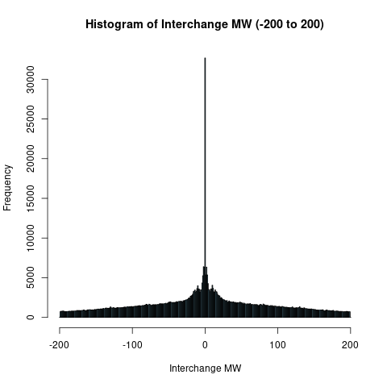
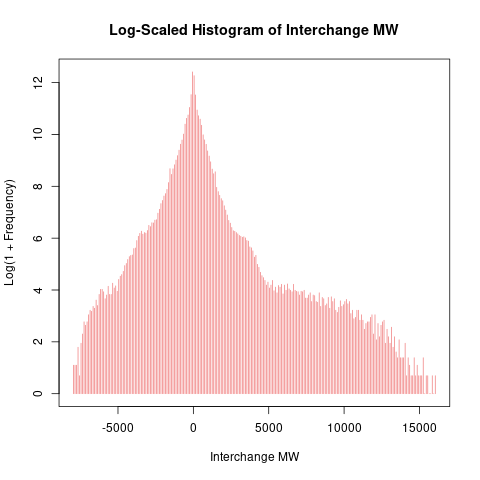
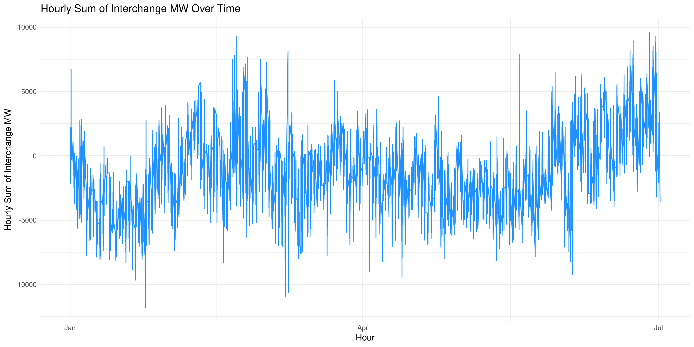
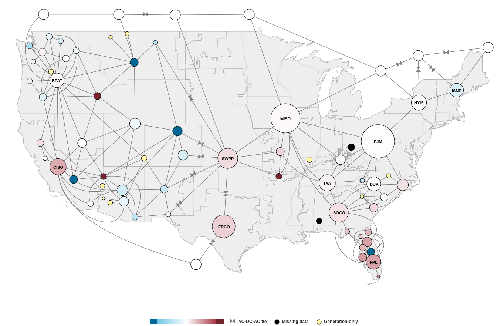
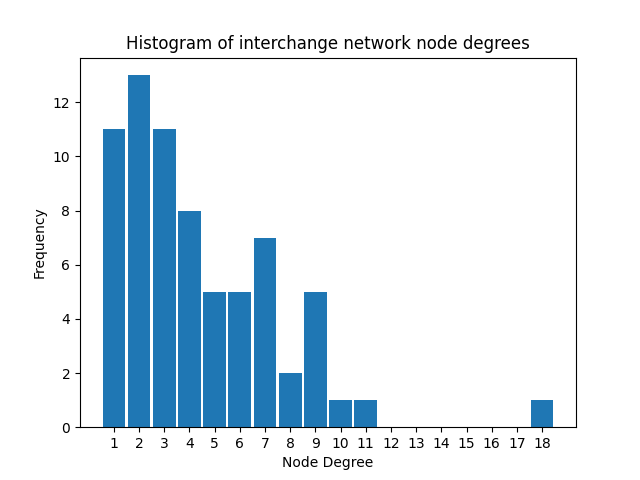

# EIA930 Interchange and Balance Data
This project aims to provide tools for the collection and manipulation of EIA930 Interchange and Balance data using graph theoretic techiques and the Python [NetworkX](https://networkx.org/) library, and then use those tools to analyze the data in a reproducible way.

The main tools developed so far are: `data/get_clean_data.sh`, which downloads, creates backups, and cleans EIA930 Balance and Interchange data for a given year; `py/EIA930GraphBuilder.py`, which implements helper functions to instantiate EIA930 interchange and balance data as various NetworkX graphs with useful timestamped generation and interchange attributes.

Steps to reproduce the analysis can be found in `reproduction_steps.md`.

## Preliminary Analysis of Interchange Data
This analysis explores the interchange data from the [EIA](https://www.eia.gov/electricity/gridmonitor/about) for the period January to June 2023. Every hour of every day, each Balancing Authority reports the average megawatts flowing to each connected Balancing Authority. And so they report on the estimated amount of energy flowing between Balancing Authorities. More detailed information can be found [here](https://www.eia.gov/electricity/gridmonitor/about).

Below are some preliminary visualizations and observations derived from the data.

### 1. Histogram of Interchange MW (-200 to 200)
The first and third quantiles of the Interchange MW data are approximately -200 and 200, so I plot a histogram in that range.

**Results:**  
The most common data point is zero (by a factor of ~5)! Frequencies decay rapidly and symmetrically away from 0. However, there are unusual humps near +/- 10 MW—possibly indicative of lazy data. Why would data near +/- 10 MW be more common? The data description mentions that balancing authorities (BAs) can sometimes report inaccurate data, so lazy data might be more likely.

### 2. Log-Scaled Histogram of Interchange MW
I use a log-scaled histogram to understand the stucture of the data away from zero.

**Results:**  
The counts indeed decay exponentially, as expected, with a notable "shelf" on the right side between 5,000 and 10,000 MW. So there are some extreme values in the dataset, warranting further investigation.

### 3. Time Series of Hourly Sum of Interchange MW
If the data were perfect, summing over every Interchange MW entry for the same hour should net to zero, because if A reports an average of 10 MW flowing to B, then B should report an average of -10 MW flowing to A, resulting in a net of zero. So I sum all entries for each hour, and then plot the time series for the entire six months.

**Results:**  
The sums as a function of time appear quite random. The data are far from perfect, noting hourly sums at large as +/- 10,000 MW. But when compared to the approximately 1.3 million MW generation capacity of the US grid, these errors are on the order of one percent. Furthermore, we should be summing the absolute value of the sum of the two directed Interchange MW values between each interconnected BA, because with the current approach, postive errors in one interconnection could be offset by negative errors in another. This should be re-examined with graph tools.

## Grid Analysis
We can use the timestamped edge data to contruct the simple undirected graph which shows available interconnections between Balancing Authorities (see the `EIA930Grid` class in `py/EIA930Graphs.py`). The actual interconnections are more complicated than "BA AECI is connected to BA MISO", but examining the graph could provide useful initial insights.

The EIA produces a "grid monitor" tool which formats the nodes and edges on a map of the lower 48 states:

It is this graph that we are currently analyzing.

Here is a histogram of the degrees of the nodes:

The outlier with degree 18 is Bonneville Power Administration (BPAT) which produces hydropower in the Columbia River Basin. It will be interesting to see if those interconnections imply a large amount of interchange from BPAT.

Other interesting graph properties include:
- There are no cut-edges (or bridges) except for those to the 11 nodes with degree 1. This is probably no accident, as cut-edges imply weaknesses in the grid, where a severed interconnection could partition the grid into disjoint sub-grids.
- There is one maximum clique with 5 nodes in the Southeast. The BAs in the clique are: `['SOCO', 'DUK', 'SC', 'SCEG', 'SEPA']`. Incorporating pricing data may lead to interesting econmics not seen at other less connected BAs.

---

### Next steps
Further investigation of the interchange and generation data at individual timestamps is required. Using graph techniques may reveal more structure to the data. The AC-DC-AC ties should be investigated further. The results derived in R should be reproduced using the `EIA930Graphs` classes in Python.
