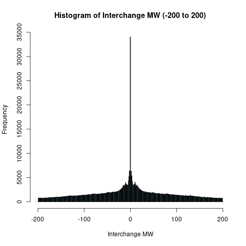
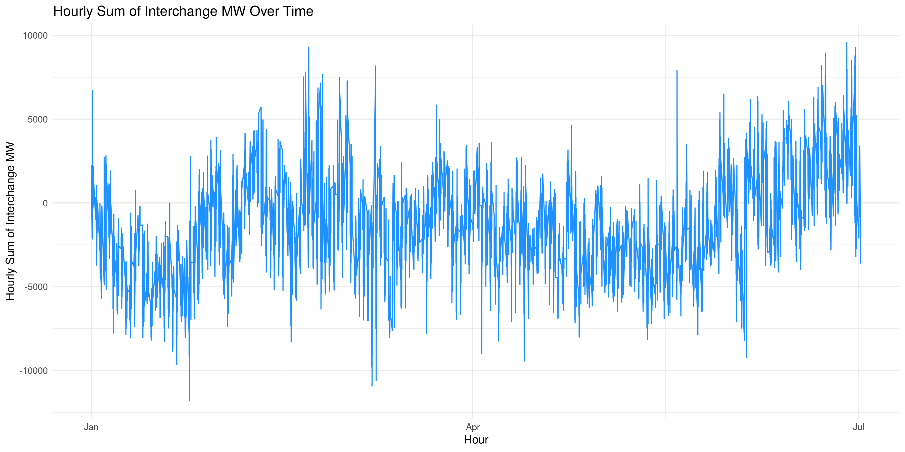

# Preliminary Analysis of Interchange Data

This analysis explores the interchange data from the [EIA](https://www.eia.gov/electricity/gridmonitor/about) for the period January to June 2023. Every hour of every day, each Balancing Authority reports the average megawatts flowing to each connected Balancing Authority. And so they report on the estimated amount of energy flowing between Balancing Authorities. More detailed information can be found [here](https://www.eia.gov/electricity/gridmonitor/about).

Below are some preliminary visualizations and observations derived from the data.

## 1. Histogram of Interchange MW (-200 to 200)
The first and third quantiles of the Interchange MW data are approximately -200 and 200, so we plot a histogram in that range.

**Results:**  
The most common data point is zero (by a factor of ~5)! Frequencies decay rapidly and symmetrically away from 0. However, there are unusual humps near +/- 10 MW—possibly indicative of lazy data. Why would data near +/- 10 MW be more common? The data description mentions that balancing authorities (BAs) can sometimes report inaccurate data, so lazy data might be more likely.

## 2. Log-Scaled Histogram of Interchange MW
We use a log-scaled histogram to understand the stucture of the data away from zero.

**Results:**  
The counts indeed decay exponentially, as expected, with a notable "shelf" on the right side between 5,000 and 10,000 MW. This could suggest some extreme values in the dataset, potentially warranting further investigation.

## 3. Time Series of Hourly Sum of Interchange MW
If the data were perfect, summing over every Interchange MW entry for the same hour should net to zero, because if A reports an average of 10 MW flowing to B, then B should report an average of -10 MW flowing to A, resulting in a net of zero. So we sum all entries for each hour, and then plot the time series for the entire six months.

**Results:**  
The sums as a function of time appear quite random. The data are far from perfect, noting hourly sums at large as +/- 10,000 MW. But when compared to the approximately 1.3 million MW generation capacity of the US grid, these errors are on the order of one percent.

---

### Next steps

The data require further examination, especially regarding the exponential decay pattern and the potential reporting issues highlighted in the discrepancies between BAs. Graph models might be needed to visualize and validate the behavior observed in the grid more accurately.
